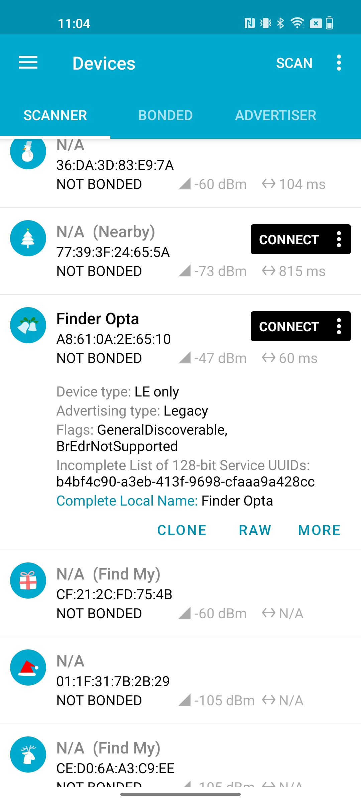
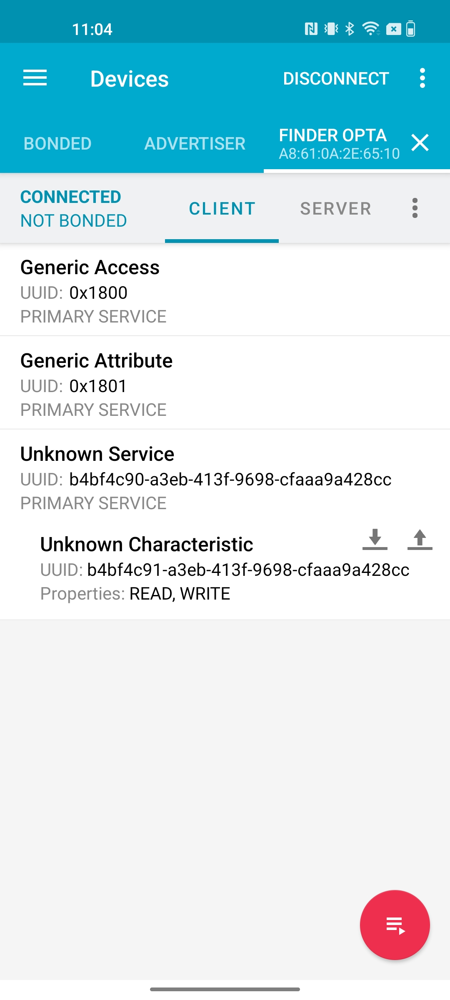
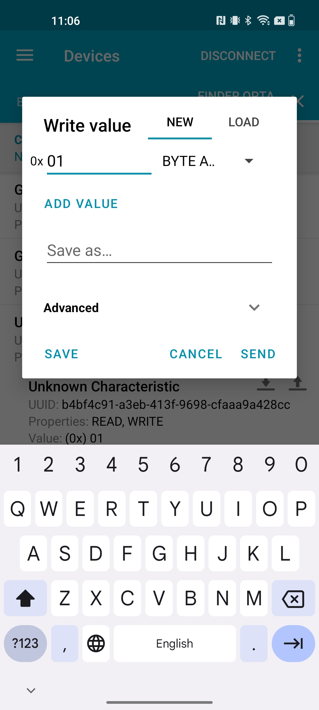
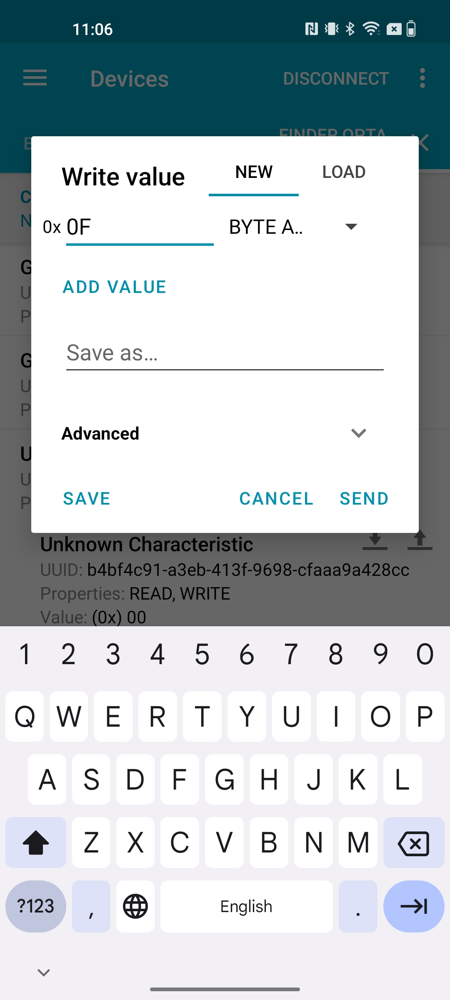

## Overview

In this tutorial, we will show how to configure the Finder Opta to make it act
as a BLE Peripheral, to which a Central can connect to pilot the LEDs of the
device. In particular, we will configure a Service containing a read and write
Characteristic, so that a Central can read and write hexadecimal values
corresponding to different LEDs states.

## Goals

* Learn how to create a BLE Service and Characteristic on the Finder Opta.
* Learn how to read data written by a Central inside the Characteristic of the
  Finder Opta.

## Required Hardware and Software

### Hardware Requirements

* PLC Finder Opta (x1).
* Cavo USB-C® (x1).

### Software Requirements

* [Arduino IDE 1.8.10+](https://www.arduino.cc/en/software), [Arduino IDE
2.0+](https://www.arduino.cc/en/software) or [Arduino Web
Editor](https://create.arduino.cc/editor).
* If you choose an offline Arduino IDE, you must install the `ArduinoBLE`
library. You can install it using the Library Manager of the Arduino IDE.
* [Example code](assets/OptaBLEPeripheralExample.zip).

## Finder Opta and BLE

Using the `ArduinoBLE` library, the Finder Opta can act as BLE Peripheral and
configure Services with one or more Characteristics in read and/or write mode.
When using this library the Finder Opta can also start advertising and wait for
a Central to connect and exchange commands.

## Instructions

### Setting up the Arduino IDE

This tutorial will need [the latest version of the Arduino
IDE](https://www.arduino.cc/en/software). If it is your first time setting up
the Finder Opta, check out the [getting started
tutorial](/tutorials/opta/getting-started).

Make sure you install the latest version of the
[`ArduinoBLE`](https://www.arduino.cc/reference/en/libraries/arduinoble/)
library, as it will be used for BLE communication with the Central.

For further details on how to manually install libraries refer to [this
article](https://support.arduino.cc/hc/en-us/articles/5145457742236-Add-libraries-to-Arduino-IDE).

### Code Overview

The goal of the following example is to configure the Finder Opta as BLE
Peripheral, then to expose a read and write Characteristic that a Central can
write to, in order to turn on or off the LEDs of the Finder Opta. In
particular, we will configure a Service with a Characteristic in it and we will
start advertising, waiting for write by the Central which contain the
hexadecimal commands that pilot the LEDs.

#### Sketch setup

At the start of the sketch we declare the BLE Service and Characteristic with
their relative UUIDs. Additionally, the Characteristic will be configured in
_read/write_ mode:

```cpp
BLEService ledService("b4bf4c90-a3eb-413f-9698-cfaaa9a428cc");
BLEByteCharacteristic ledCharacteristic("b4bf4c91-a3eb-413f-9698-cfaaa9a428cc", BLERead | BLEWrite);
```

In the `setup()` function we will configure the advertised name of the device,
and then we will pair Service and Characteristic, also setting its initial
value; at the end of these operations we will start advertising. The code of
the function is shown below:

```cpp
void setup()
{
    Serial.begin(9600);

    // Init the BLE service.
    if (BLE.begin() == 0)
    {
        while (1)
        {
        }
    }

    // Set local name and service UUID.
    BLE.setLocalName("Finder Opta");
    BLE.setAdvertisedService(ledService);

    // Add service and characeristic.
    ledService.addCharacteristic(ledCharacteristic);
    BLE.addService(ledService);

    // Set initial value.
    ledCharacteristic.writeValue(0x00);

    // Start advertising.
    BLE.advertise();
}
```

#### Main loop

The `loop()` function of this sketch listens for connections by the Central,
until one is actually connected: at that point, the Finder Opta will check if
something was written inside the `ledCharacteristic`, and in case it was it
will read the value to control the LEDs from number 0 to number 3. The code of
the main loop is attached below:

```cpp
void loop()
{
    // Check if any central is available.
    BLEDevice central = BLE.central();
    if (central)
    {
        Serial.println("Central connected.");
        while (central.connected())
        {
            // If central wrote to characeristic.
            if (ledCharacteristic.written())
            {
                uint8_t state = ledCharacteristic.value();
                digitalWrite(LED_D0, state & 0x01);
                digitalWrite(LED_D1, (state & 0x02) >> 1);
                digitalWrite(LED_D2, (state & 0x04) >> 2);
                digitalWrite(LED_D3, (state & 0x08) >> 3);
            }
        }
        Serial.println("Central disconnected.");
    }
}
```

Note that the state of the _n_ LED will depend on the value of the _n_ bit in
the command written by the Central inside the `ledCharacteristic`: if the _n_
bit is set to 1 the _n_ LED will be turned on, if the _n_ bit is set to 0 the
_n_ LED will be turned off. In the comments of the code we included a table
containing the mapping between hexadecimal code of the command and LEDs
behavior.

### Interaction example

Once the sketch has been compiled and uploaded to the Finder Opta, we can use
the  [nRF
Connect](https://www.nordicsemi.com/Products/Development-tools/nrf-connect-for-mobile)
app to connect to the BLE Peripheral and write a command inside the
Characteristic. At the end of a scan, the Finder Opta will appear among the
available devices:



We then proceed by connecting to the device, after which we see a Service and a
Characteristic with UUIDs matching the ones assigned by the sketch:



Let's now click on the icon with the arrow pointing up in order to perform a
write. The screenshots show examples of how to turn on LED 0 and LED 3:




Finally, this last screenshot shows how to turn on all the LEDs of the Finder
Opta with a single command:



## Conclusion

This tutorial shows how to configure the Finder Opta as BLE Peripheral, in
order to expose a Characteristic in which a Central can write an hexadecimal
command to pilot the state of the LEDs of the device.
